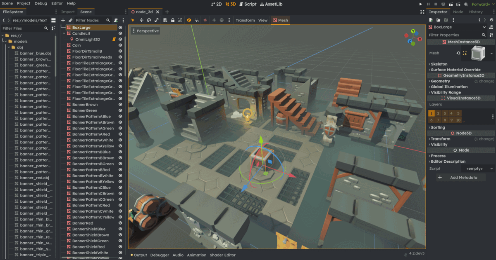

# godot-4-gapless-theme
An editor theme for Godot 4.1+ that:

- removes gaps between panels
- lessens space taken between items
- changes fewest items possible to ensure the user can still define their own colours

## Instalation

- download the theme file or pull repo
- godot -> editor settings -> custom theme -> select the downloaded theme

